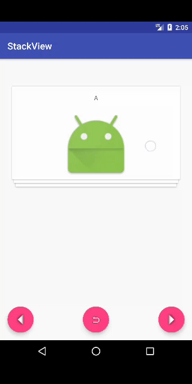

# StackView
[  ](https://bintray.com/abhijitparate/Android/StackView/_latestVersion)

A simple checklist view featuring edit, delete, rearrange items.
Also converts to ArrayList of items and JSON.



## Gradle
```
dependencies {
    ...
    compile 'com.github.abhijitparate:stackview:1.1.5'
}
```

## Usage

```
<com.github.abhijitpparate.stackview.StackView
        android:id="@+id/stack_view"
        android:layout_width="368dp"
        android:layout_height="495dp"
        android:layout_marginBottom="8dp"
        android:layout_marginLeft="8dp"
        android:layout_marginRight="8dp"
        android:layout_marginTop="8dp"
        app:layout_constraintBottom_toBottomOf="parent"
        app:layout_constraintLeft_toLeftOf="parent"
        app:layout_constraintRight_toRightOf="parent"
        app:layout_constraintTop_toTopOf="parent" />
```